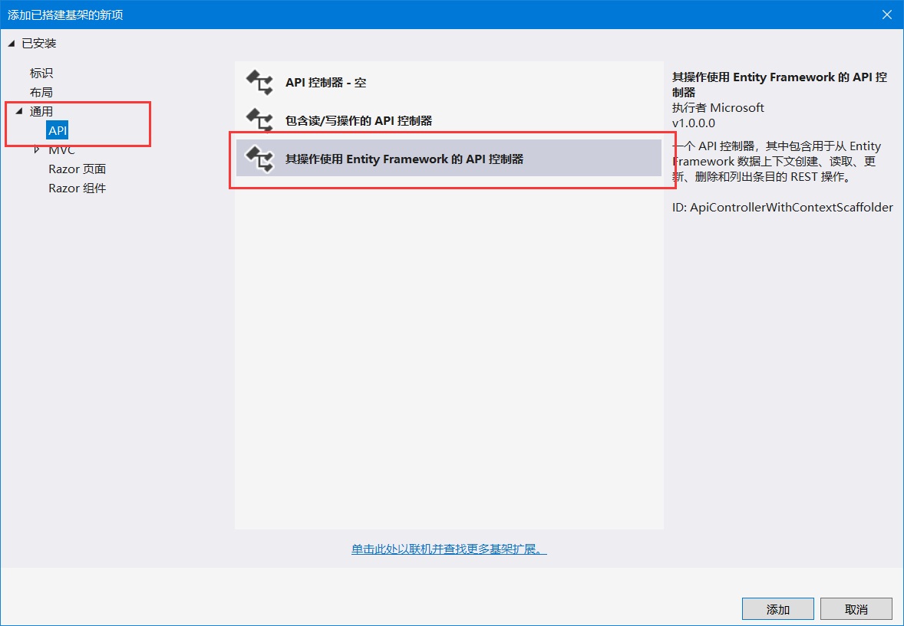
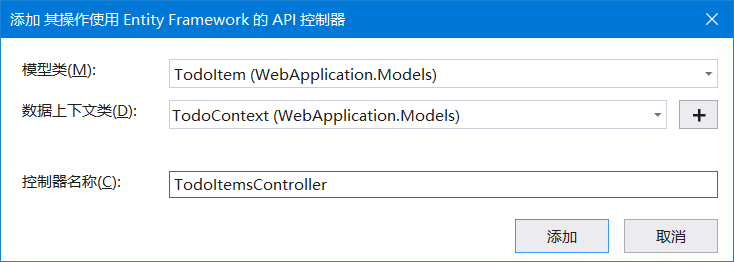

#  .NET Core Web API基础教程(案例)

项目包含三个模板

- TodoItem (基础)

  > Models/TodoItem 
  >
  > Models/TodoContext
  >
  > Controllers/TodoItemsController

- Inventory (SqlServer)

  > Models/Inventory
  >
  > Models/InventoryContext
  >
  > Controllers/InventoriesContext

- Student (SqlServer + 类似SpringBoot)

  > Entity/Student
  >
  > Service/StudentService
  >
  > Service/Impl/StudentServiceImpl
  >
  > DAO/StudentContext
  >
  > Controller/StudentController


## 1.TodoItem模板 ([详见](https://docs.microsoft.com/zh-cn/aspnet/core/tutorials/first-web-api?view=aspnetcore-3.1&tabs=visual-studio))

> TodoItem模板采用内存数据库，只能在程序运行时使用，随着程序运行的结束而销毁

### 1.1 新建 TodoItem.cs文件

```csharp
namespace WebApplication.Models
{
    public class TodoItem
    {
        public long Id { get; set; }
        public string Name { get; set; }
        public bool IsComplete { get; set; }
    }
}
```

### 1.2 新建TodoContext.cs文件

```csharp
using Microsoft.EntityFrameworkCore;

namespace WebApplication.Models
{
    public class TodoContext : DbContext
    {
        // 必须要有一个空参构造器
        public TodoContext(DbContextOptions<TodoContext> options)
            : base(options)
        {
        }

        // 用于操作数据库
        public DbSet<TodoItem> TodoItems { get; set; }
    }
}
```

### 1.3 建立TodoController.cs文件

在Controller文件夹下，添加`新搭建基架的项目`，





然后即可生成TodoController.cs文件，

需要注意：

- 继承了ControllerBase类，ControllerBase类是所有自定义Controller的父类；在MVC项目中，继承的是Controller类；而Controller类继承ControllerBase类；ControllerBase类只包含最基本的Controller方法，而Controller类包含有支持MVC的方法

- 异步请求，需要在方法上加上`async`，并且方法的返回需要是Task类型，并且在return语句中，要加上await，并且调用context的异步方法，如

  ``` cs
  public async Task<ActionResult<IEnumerable<TodoItem>>> GetTodoItems()
  {
      // 异步方法ToListAsync(); 同步方法ToList();
      return await _context.TodoItems.ToListAsync();
  }
  ```

- [ApiController]注解表示，此控制器为Api控制器，所以接收的参数和返回的参数自动包装为json，并且可以拆箱装箱，如

  ```cs
  // [FromBody]可省略，因为有ApiController注解了
  // 类似的注解还有[FromForm] [FromRoute] [FromQuery] [FromHeader]
  public async Task<ActionResult<TodoItem>> PostTodoItem([FromBody] TodoItem todoItem){...}
  ```

- [HttpPost] [HttpPut("{id}")] 表示接收的请求方法，并且可接收Resuful参数

### 1.4 修改startup.cs

在ConfigureServices方法中，加入

```cs
services.AddDbContext<TodoContext>(opt =>
       opt.UseInMemoryDatabase("TodoList"));
```

表示，使用内存数据库，数据库名为TodoList。

此项操作将TodoContext`注入(DI)`到项目。然后即可运行测试


## 2.Inventory 模板

### 2.1 新建Inventory.cs文件

```cs
namespace WebApplication.Models
{
    public class Inventory
    {
        public string Name { get; set; }
        public int Id { get; set; }
        public int Quantity { get; set; }

    }
}
```

### 2.2 新建InventoryContext.cs文件

与`1.2`节有所不同的是，在使用SqlServer数据库中，除了指明数据库，还要指明表

因此，额外加上OnModelCreating方法，意在指明Context适配的表，还要指明主键

``` cs
using Microsoft.EntityFrameworkCore;
using Microsoft.EntityFrameworkCore.Metadata.Builders;

namespace WebApplication.Models
{
    public class InventoryContext : DbContext
    {
        public InventoryContext(DbContextOptions<InventoryContext> options)
            : base(options)
        {
        }

        protected override void OnModelCreating(ModelBuilder modelBuilder)
        {
            base.OnModelCreating(modelBuilder);
            EntityTypeBuilder<Inventory> entityTypeBuilder = modelBuilder.Entity<Inventory>();
            entityTypeBuilder.ToTable("Inventory");
            entityTypeBuilder.HasKey(e => e.Id);
        }


        public DbSet<Inventory> Inventories { get; set; }
    }
}
```

### 2.3建立InventoriesController.cs文件

步骤同`1.3`节

### 2.4 修改startup.cs

在ConfigureServices方法中，加入

```cs
services.AddDbContext<InventoryContext>(opt =>
	opt.UseSqlServer(
     	Configuration.GetConnectionString("DefaultConnection")
     )
);
```

表示，注入的InventoryContext使用SqlServer，并且指定配置

配置文件需要在appsettings.json文件中指明

```json
"ConnectionStrings": {
    "DefaultConnection": "Data Source=(IP地址)192.168.0.102;Initial Catalog=test(数据库名);Persist Security Info=True;User ID=sa;Password=*****"
},
```

然后即可运行测试


## 3. Student模板

此模板仿照Java Web API项目的架构设计，熟悉SpringBoot或SSM的人会感到很熟悉。

### 3.1 新建Student.cs文件

```cs
using System.ComponentModel.DataAnnotations;
using System.ComponentModel.DataAnnotations.Schema;
namespace WebApplication.Entity
{
    [Table("Student")]
    public class Student
    {
        [Column("student_id")]
        [Key]
        public int student_id { get; set; }

        [Column("student_name")]
        public string student_name { get; set; }

        [Column("student_gender")]
        public string student_gender { get; set; }
    }
}
```

这里直接在实体类中声明所属的表和主键等信息，省去了在Context中声明的步骤

### 3.2 新建StudentService.cs接口

```cs
namespace WebApplication.Service
{
    public interface StudentService
    {
        bool CreateStudent(Student student);

        Task<ActionResult<IEnumerable<Student>>> GetStudents();

        Student GetStudentById(int id);

        bool UpdateStudent(Student student);

        bool UpdateNameByID(int id, string name);

        bool DeleteStudentByID(int id);
    }
}
```

### 3.3 新建StudentServiceImpl.cs文件

等同于将上面两个模板的Controller挪到这里。代码很好懂，包括了同步方法和异步方法

```cs
using Microsoft.AspNetCore.Mvc;
using Microsoft.EntityFrameworkCore;
namespace WebApplication.Service.ServiceImpl
{
    public class StudentServiceImpl : StudentService
    {

        public StudentContext _context;

        public StudentServiceImpl(StudentContext context)
        {
            _context = context;
        }


        public bool CreateStudent(Student student)
        {
            _context.Students.Add(student);
            return _context.SaveChanges() > 0;
        }

        public bool DeleteStudentByID(int id)
        {
            var student = _context.Students.SingleOrDefault(s => s.student_id == id);
            _context.Students.Remove(student);
            return _context.SaveChanges() > 0;
        }

        public Student GetStudentById(int id)
        {
            return _context.Students.SingleOrDefault(s => s.student_id == id);
        }

        public async Task<ActionResult<IEnumerable<Student>>> GetStudents()
        {
            return await _context.Students.ToListAsync();
        }

        public bool UpdateNameByID(int id, string name)
        {
            var state = false;
            var student = _context.Students.SingleOrDefault(s => s.student_id == id);
            if (student != null)
            {
                student.student_name = name;
                state = _context.SaveChanges() > 0;
            }

            return state;
        }

        public bool UpdateStudent(Student student)
        {
            _context.Students.Update(student);
            return _context.SaveChanges() > 0;
        }
    }
}
```

### 3.4 新建StudentContext.cs文件

文件结构同上

```cs
using Microsoft.EntityFrameworkCore;
namespace WebApplication.DAO
{
    public class StudentContext :DbContext
    {
        public StudentContext(DbContextOptions<StudentContext> opt) 
            : base(opt)
        {
        }

        public DbSet<Student> Students { get; set; }
    }
}
```

### 3.5新建StudentController.cs文件

作为测试，仅调用两个Service方法

```cs
using Microsoft.AspNetCore.Mvc;
namespace WebApplication.Controllers
{
    [Route("api/[controller]")]
    [ApiController]
    public class StudentController : ControllerBase
    {
    // 注意这里是StudentService的接口，而不是StudentServiceImpl
        private readonly StudentService _studentService;

        public StudentController(StudentService studentService)
        {
            _studentService = studentService;
        }


        [HttpPost]
        [Route("add")]
        public ActionResult<string> Create(Student student)
        {
    
            if (string.IsNullOrEmpty(student.student_name.Trim()))
            {
                return "姓名不能为空";
            }
            if (!student.student_gender.Equals("0") && !student.student_gender.Equals("1"))
            {
                return "性别数据有误";
            }
            var result = _studentService.CreateStudent(student);
            if (result)
            {
                return "学生插入成功";
            }
            else
            {
                return "学生插入失败";
            }

        }

        //取全部记录
        [HttpGet]
        [HttpPost]
        [Route("getAll")]
        public Task<ActionResult<IEnumerable<Student>>> Gets()
        {
            return _studentService.GetStudents();
        }


    }
}
```

### 3.6同Spring一样，将这些类都注入到应用中

在startup.cs文件中，加入

```cs
services.AddDbContext<StudentContext>(opt =>
	opt.UseSqlServer(
		Configuration.GetConnectionString("DefaultConnection")
	)
);
services.AddScoped<StudentService, StudentServiceImpl>();
```

然后即可运行测试


## 4.参考

1.[使用ASP.NET Core 3.x 构建 RESTful API - 1.准备工作](https://www.cnblogs.com/cgzl/p/11814971.html)

2.[ASP.NET Core使用EF Core操作MySql数据库](https://www.cnblogs.com/alan-lin/p/9997657.html)

3.[使用 Entity Framework Core 实现基础结构持久性层](<https://docs.microsoft.com/zh-cn/dotnet/architecture/microservices/microservice-ddd-cqrs-patterns/infrastructure-persistence-layer-implemenation-entity-framework-core>)

4.[教程：使用 ASP.NET Core 创建 Web API](<https://docs.microsoft.com/zh-cn/aspnet/core/tutorials/first-web-api?view=aspnetcore-3.1&tabs=visual-studio>)


首次接触ASP .NET Core，如有错误，烦请指正( •̀ ω •́ )✧