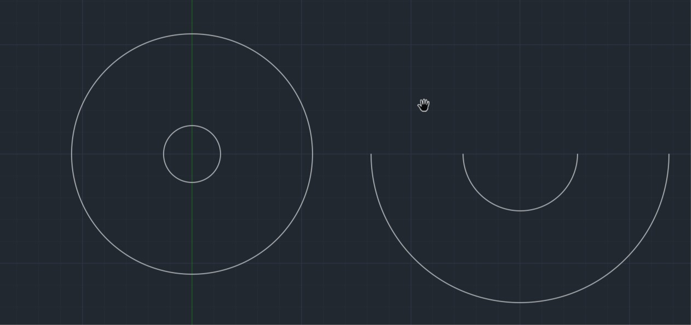

# .NET开发AutoCAD  
VS建立控制台应用（.NET FrameWork）   
文件initClass.cs
```csharp
using System;
using System.Collections.Generic;
using System.Linq;
using System.Text;
using System.Threading.Tasks;
using Autodesk.AutoCAD.ApplicationServices;
using Autodesk.AutoCAD.EditorInput;
using Autodesk.AutoCAD.Runtime;
//定义InitClass类为程序的入口点
[assembly:ExtensionApplication(typeof(InitAndOpt.InitClass))]
//让AutoCAD只会执行OptimizeClass类中定义的命令
[assembly:CommandClass(typeof(InitAndOpt.OptimizeClass))]
namespace InitAndOpt
{
    public class InitClass : IExtensionApplication
    {
        public void Initialize()
        {
            Editor ed = Application.DocumentManager.MdiActiveDocument.Editor;
            //在autoCAD命令行上显示一些信息，他会在程序载入时被显示
            ed.WriteMessage("程序开始初始化");
        }

        public void Terminate()
        {
            System.Diagnostics.Debug.WriteLine("程序结束，你可以在内做一些程序的清理工作，如关闭AutoCAD文档");
        }

        //程序并没有设定InitClass类为CommandClass类，因此AutoCAD不会执行该类中的命令
        [CommandMethod("InitCommand")]
        public void InitCommand()
        {
            Editor ed = Application.DocumentManager.MdiActiveDocument.Editor;
            ed.WriteMessage("test");
        }
    }
}

```

文件OptimizeClass.cs  
载入dll文件，可以由其他.NET开发AutoCAD的过程生成得到。  
```csharp
using System;
using System.Collections.Generic;
using System.Linq;
using System.Text;
using System.Threading.Tasks;
using Autodesk.AutoCAD.ApplicationServices;
using Autodesk.AutoCAD.EditorInput;
using Autodesk.AutoCAD.Runtime;

namespace InitAndOpt
{
    public class OptimizeClass
    {
        [CommandMethod("OptCommand")]
        public void OptCommand()
        {
            Editor ed = Application.DocumentManager.MdiActiveDocument.Editor;
            string fileName1 = "C:\\Users\\XXX\\XXX.dll";
            ExtensionLoader.Load(fileName1);
            ed.WriteMessage("\n"+ fileName1 +"被载入,请输入Hello进行测试!!!!!!");
        }
    }
}

```

在AutoCAD中cmd里输入netload-->optcommand-->(CommandMethod) 

```csharp
        [CommandMethod("drawCircle")]
        public void drawCircle(){
            //获取当前活动图形数据库
            Database db = HostApplicationServices.WorkingDatabase;
            //获取命令行对象
            Editor ed = Application.DocumentManager.MdiActiveDocument.Editor;

            //整圆
            double radius = (7.0 / 10.0 * L)  + (FW + BW) / 2 / Math.PI;
            Point3d O = new Point3d(0, 200, 0);
            double OA = (FW + BW) / 2 / Math.PI;
            Arc Circle1 = new Arc(O, OA, 0, Math.PI * 2 - 0.0001);
            Arc Circle0 = new Arc(O, radius, 0, Math.PI * 2 - 0.0001);

            //半圆
            double radius1 = (7.0 / 10.0 * L) + (FW + BW) / Math.PI;
            Point3d O1 = new Point3d(150, 200, 0);
            double O1A1 = (FW + BW) / Math.PI;
            Arc Circle11 = new Arc(O1, O1A1, Math.PI, Math.PI * 2);
            Arc Circle01 = new Arc(O1, radius1, Math.PI, Math.PI * 2);

            //Ellipse ellipse = new Ellipse(new Point3d(0, 0, 0), new Vector3d(0, 0, 1), new Vector3d(100, 0, 0), 0.6,0,Math.PI*2);

            //定义一个指向当前数据库的事物处理
            using (Transaction trans = db.TransactionManager.StartTransaction())
            {
                BlockTable bt = (BlockTable)trans.GetObject(db.BlockTableId, OpenMode.ForRead);
                BlockTableRecord btr = (BlockTableRecord)trans.GetObject(bt[BlockTableRecord.ModelSpace], OpenMode.ForWrite);
                db.AddToModelSpace(Circle1, Circle0, Circle01, Circle11);
                trans.Commit();
            }
        }
```

